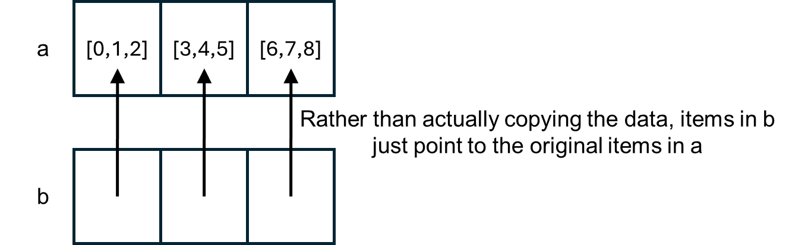

.. role:: python(code)
   :language: python

Shallow vs. deep copies
=======================
As a last, relatively minor point before some of the more advanced fundamentals, we have a small note about making copies. This doesn't always give the behavior people are expecting when they are starting out.

If you have code such as 

.. code-block:: python

   a = [[0, 1, 2], [3, 4, 5], [6, 7, 8]]
   b = list(a)

:python:`b` is a copy of :python:`a`. However, it is a *shallow copy*. To save space in memory, the entries (0 to 8 in this case) aren't actually copied. Rather, a new variable :python:`b` is made, and its entries just point to the the original entries in :python:`a`. This is shown below.

If you then run

.. code-block:: python

   a[0][0] = '1'

you'll find that both :python:`a` and :python:`b` have updated. However, if you run

.. code-block:: python

   a.append([9, 10, 11])

:python:`b` won't have this added to it. :python:`b` won't know where any additional locations in :python:`a` from after the copy was made. This use of memory is illustrated in the figure below.

This can lead to some confusing behavior if you're not expecting it! 

If you want two completely independent copies of a piece of data you need to make a *deep copy*. In Python this is done with

.. code-block:: python

   import copy
   c = copy.deepcopy(a)

In general deep copies should only be used when you really need them. They will use more memory, and for large items it can take quite a lot of time to actually make a copy of all of the data (rather than just pointing to the data that's already present).