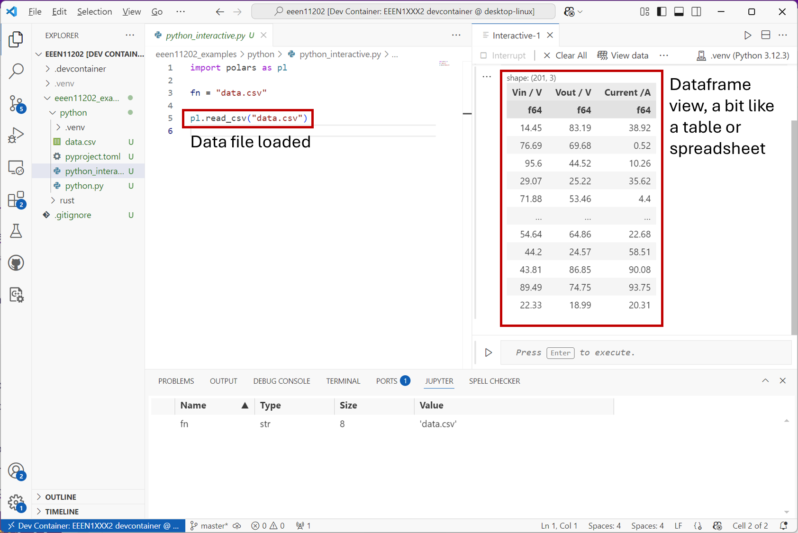

Dataframes
==========
Dataframes provide a table-like environment in order to keep our data (which could have lots of different types). It thus provides a spreadsheet-like interface for working with data, which can be very helpful. A dataframe can help us organize our data into a common (table/spreadsheet) format without having to go to the effort of defining our own objects, custom data types and so on. They are very commonly used in *data science* and *data visualization* type applications. 

A picture of a typical dataframe (here made using the `Polars <https://pola.rs/>`_ interface) in Python is shown below. 

We won't consider the details of dataframes in more detail here, we will explore them in the labs instead.

Not every programming languages has the concept of dataframes, and you can always use a 2D list or array or similar in a table-like structure. Nevertheless, when dataframes are available they provide lots of built in functions to help processing data. 