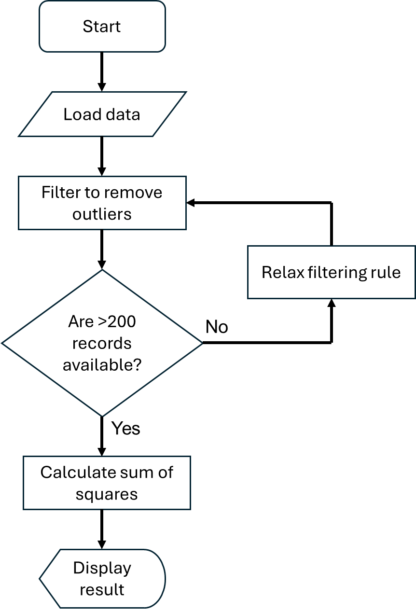
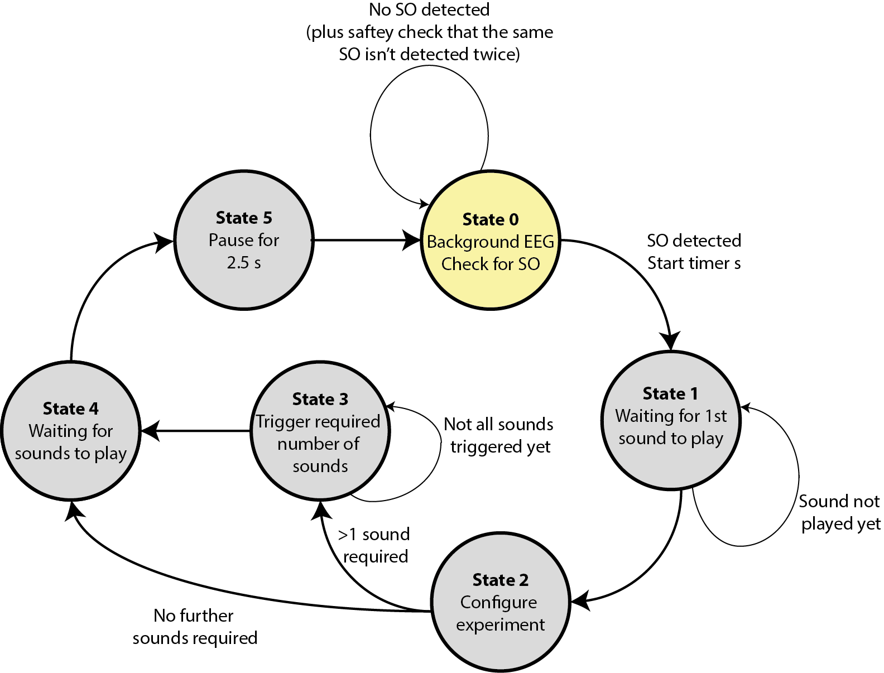

Design patterns
===============
Once you have data, stored in objects and variables, and ways to manipulate data in methods and functions, ways to control the program flow, and ways to handle errors, you fundamentally have what you need to start building up complex programs. In most cases this probably starts by thinking about the data - how it is best stored, what objects and methods do you want? As we saw when :ref:`introducing objects <objects>` you can use the type system to help you avoid making errors. 

We also introduced :ref:`software architecture <software_architecture>` briefly. You do need to *design* a program. In the same way that you wouldn't build a house without having plans and drawings in advance, it's extremely hard to write programs with millions of lines of code without some plans and drawings in advance. 

`UML (Unified Modeling Language) <https://en.wikipedia.org/wiki/Unified_Modeling_Language>`_ is one widely used approach to visualize a program structure, but goes beyond the scope of this course. We thus won't say too much about this. A lot in this area comes from gaining hands on experience, and seeing what works and what doesn't work for your needs. Also, in many cases in practice when starting out you'll be working on a code base which already exists, improving it and adding features, rather than starting from a blank slate. 

However we want to highlight two common *design patterns*, that is, ways of thinking about how the code is structured. These can help you start thinking about how you might structure your code, and you can then go further in your `further reading <https://uom-eee-eeen11202.github.io/chapters/course_administration/suggested_reading.html>`_ if you desire. 

Flow charts
-----------
The programming we're going to look at is known as *imperative* programming. The code execution may jump from place to place as we use different functions and methods, but fundamentally the code executes line by line starting from the top of the code file. This means that flowcharts tend to naturally fit into representing the functionality we need. A simple example flowchart is shown below. 

This is quite a high level flow chart. You can of course add more details, whether that be steps, or details on what the data looks like at each stage. Most undergraduates are already familiar with flow charts, and so we won't give more details here other than to note that there is an international standard (ISO 5807) for which shapes should be used in a flow chart. 

State machines
--------------
A second common design pattern, and one which in my experience is overlooked by undergraduates, is *state machines*. (In my experience most undergraduates tend to go straight to flow charts.) 

You'll actually encounter state machines in your digital electronics courses. They are commonly used in the design of digital hardware. They can be just as useful in the design of software. 

Here you think about the discrete *states* that program might have, and what triggers the state to change. For example, there might be an *initialization* state where files and similar are loaded. There might be a *wait* state while waiting for some user input or a file to finish downloading. There might also be a *shutdown* state where everything is tidied up before the program terminates. A simple example is shown on the state diagram below. 

Here *EEG* refers to the data that is being collected in real-time from a device connected to the computer. SO refers to a specific feature in this data that we want to detect. If an SO is detected, we want to play a fixed number of sounds, after some delays. The system starts in *State 0* and then moves round once an SO is detected. (This is a real example based on some of our previous research code `available here <https://github.com/ALEX-CASSON-LAB/ClosedLoopSoundStimulationDuringSleepInMatlab>`_. Note that this was coded in Matlab rather than in one of the languages we'll use in this course.)
