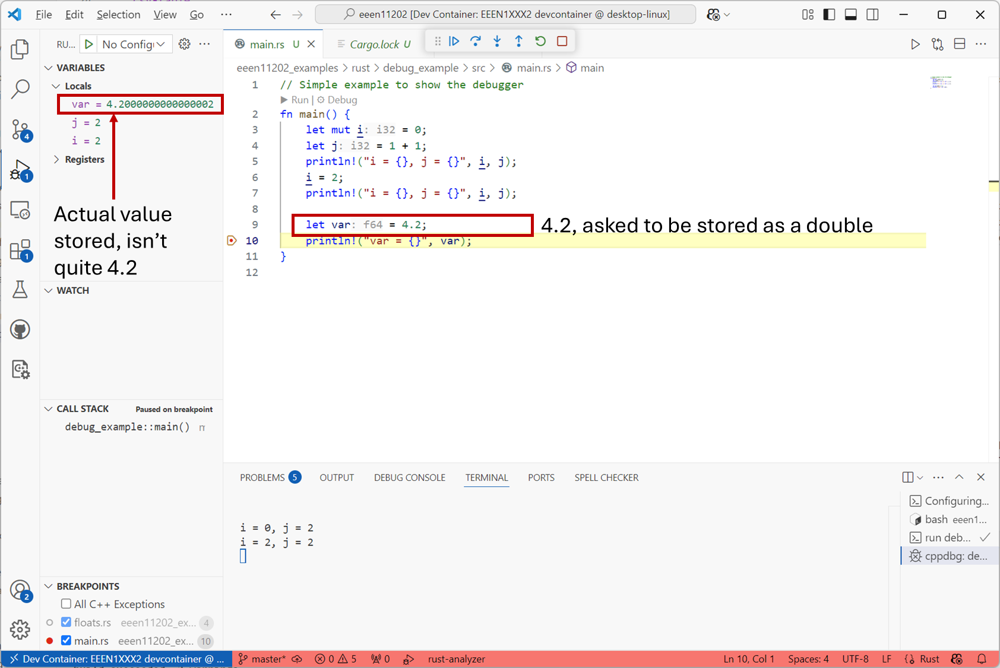

.. role:: console(code)
   :language: console

.. role:: rust(code)
   :language: rust

Floating point numbers
======================

Numbers which aren't integers, i.e. those with decimal places, are stored as *floating point numbers*.  

Most computers use a standard known as IEEE/ISO/IEC 60559 to define how we interpret the binary bits that are stored on a computer as a number with decimal places. This standard defines multiple types of floating point number, mainly:

- *Single*. Also known as a *float*.
- *Double*.
- *Quad*.

How the computer stores them
----------------------------
We won't go into the details of how a computer stores floating point numbers. You can read about the details of interpreting some bits as a *mantissa* and other bits as the *exponent* `elsewhere <https://en.wikipedia.org/wiki/Floating-point_arithmetic>`_ if you're interested.

The important point is that 32 bits are used to store a single, 64 bits for a double, and 128 bits for a quad.

Consequences of this storage
----------------------------
As with integers, as we're using a finite number of bits to store a number, and that means there are a finite number of numbers that can be represented. There's a maximum possible number that can be represented, a smallest possible number, and a smallest step change between numbers that's possible.The table below gives an indication of the precision. 

.. csv-table::
   :file: precisions.csv
   :widths: 10, 15, 15, 10
   :align: center
   :header-rows: 1

What we find, very quickly, is that not every possible number can be represented exactly as a floating point number. The example below shows an easy number, 4.2, being stored in a variable, and this variable being viewed in the :ref:`debugger <debugger>`. What is actually stored is 4.2000000000000002. (This example is using Rust, where :rust:`f64` sets the data type to be a double.)

Numbers can have an infinite number of decimal places, but we only have a finite number of bits available in a computer to store a number in. It's thus common to get a small amount of *floating point error*. 

In many situations this numerical rounding is negligible. 4.2000000000000002 is correctly representing 4.2 to 15 decimal places! This is more than enough for most situations. Imagine this 4.2 was representing a voltage that you measured from a circuit in the lab. The number would be off by 0.2 fV. That's :math:`10^{-15}` V. It's basically impossible to measure voltages that precisely, there will always be thermal or measurement or some other source of noise (which you'll learn about in your practical electronics courses) that are larger. The fact that there's some numerical noise as well, is just another source of noise.

Nevertheless, floating point error can be important to consider in some high performance situations, or if the error accumulates over multiple calculations, and so you need to be aware of it.

Number representations
----------------------
You can enter floating point numbers in a number of different ways. This includes using an :console:`e` or :console:`E` to represent an exponent (that is, a :math:`\times 10 ^{p}` factor, where :math:`p` is the number that comes after the exponent.) For example, the below are all valid ways of entering the number 57:

- :console:`57`
- :console:`57.0`
- :console:`57.0e0`
- :console:`57E0`
- :console:`5.7e1`
- :console:`5.7e+1`
- :console:`0.57e2`
- :console:`570.0e-2`

(57 is an integer, but all integers can of course also be stored as floats. Not all floats are integers though!)

Which should I use
------------------
Today, most programs for desktop/laptop type devices probably use double precision numbers by default, and no further thought is required. We suggest you stick with this, and you'll probably know, quite readily, if you're in a higher performance situation where it requires a bit more thought. 

For programs which have to be highly optimized for memory performance, or on embedded platforms, singles can be useful, as long as a little more numerical noise can be tolerated by the application. In general quads are overkill for most applications. Doubles provide more than enough accuracy, and so there's no benefit to taking a performance hit on the amount of memory needed, unless you're in a situation which really demands very small or very large numbers (or differences between numbers) to be represented. You'll probably know such a situation when we see it. 