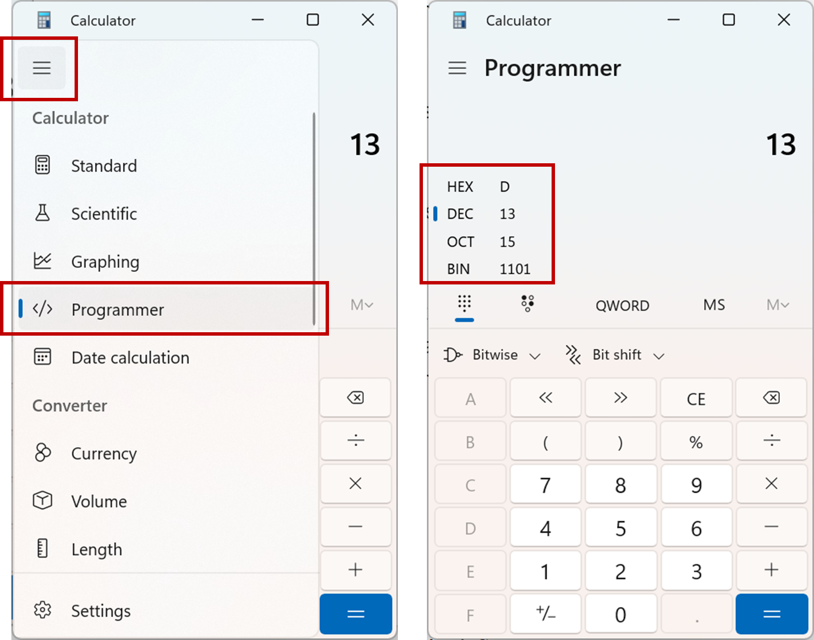

.. role:: console(code)
   :language: console

.. role:: rust(code)
   :language: rust

Integers
========

An integer refers to a whole number, e.g. 0, 1, 2, 55. Integers can also be negative, e.g. -1, -22.

It's very common to have integers when working with computer code. For example, maybe we want to store how many students are taking the class. Or, count how many files are stored on the computer. It doesn't make any conceptual sense for there to be 202.5 students taking the class. We'd thus store the number of students as an integer.

How the computer stores them
----------------------------
Within the computer memory, data is stored in binary. If we have

.. code-block:: python 

   num = 2

The number :console:`2` isn't stored directly, its binary representation is. 

The number of bits used to store an integer varies depending on the operating system of the computer, the architecture of the processor present, and how many bits you ask for. As a default, many computers use 32 bits. In this case, :console:`2` would be stored in the computer memory as :console:`0000 0000 0000 0000 0000 0000 0000 0010`.

Negative numbers are stored using `2's complement format <https://en.wikipedia.org/wiki/Two%27s_complement/>`_, which you'll learn about in digital electronics courses. Briefly, the *left-most* bit as we're writing them is used as a sign bit. :console:`0` represents a positive number, while :console:`1` indicates that a negative number is present. As examples:

- :console:`3` would be stored as :console:`0000 0000 0000 0000 0000 0000 0000 0011`.
- :console:`-2` would be stored as :console:`1111 1111 1111 1111 1111 1111 1111 1110`.`

To help further with checking our code, integers can be flagged as being *signed* or *unsigned*. Signed means the number could be positive or negative. Unsigned means it can only be positive. Rather than using an integer, when counting the number of students in the class, or the number of files on a computer, using an unsigned integer could be best - these numbers can only be positive so they should be stored in a data type which only accepts postive numbers.

In an unsigned integer, all of the bits in the word are used to represent the number. Thus:
	
- :console:`1111 1111 1111 1111 1111 1111 1111 1110` represents 4,294,967,294.

It's not that unsigned integers take the absolute value of a number. Rather, numbers that would be negative if they were signed are interpreted as large positive numbers, because of the extra bit available when no sign bit is used. 

Consequences of this storage
----------------------------

As a finite number of bits are used to store an integer, there is a maximum and minimum number that they can store. For a 32 bit signed integer the maximum number possible would be:

- :console:`0111 1111 1111 1111 1111 1111 1111 1111`.

which is :math:`2^{31} -1` which is 2,147,483,647. The minimum number would be:

- :console:`1000 0000 0000 0000 0000 0000 0000 0000`.

which is -2,147,483,648.
	
For an unsigned 32 bit integer, the maximum number is:

- :console:`1111 1111 1111 1111 1111 1111 1111 1111`.

which is :math:`2^{32} -1` which is 4,294,967,295. The minimum number is 0.

You get *overflow* or *underflow* if you try and store/use an integer which is outside of these ranges. In Python, these error cases are automatically handled for you, you won't get overflow or underflow errors in most cases. In other programming languages, if working with very large numbers you may need to be aware, and have some checks for, this. 

Number representations
----------------------

In this course, we're mainly working with small numbers, such as 100. It's easy enough to type these in directly. However, we can also type in numbers in binary, and *hexadecimal* (hex) forms, which are useful in many situations.

A hex representation of a number uses the numbers 0-9 and letters A-F to represent a single number. This gives 16 characters, and so 1 character (0-9 or A-F) can represent the 16 different possible things that 4 bits (e.g. 0110) could represent. It's thus much more compact than writing out a long binary word, or indeed using a decimal number. 

To enter a hex number you preface it with :console:`0x`. To enter a binary number, you preface the number with :console:`0b`. You can thus enter 100 as:

.. code-block:: python

	i = 100
	j = 0x64
	k = 0b01100100

All of these represent exactly the same thing, they are just different ways of entering it into the computer.

When working with hex numbers, the letters can be either upper or lower case. 

All of these store exactly the same thing in memory, they are just different ways of entering the same number. Sometimes using one form is simpler than using another, and you can switch between them to use whichever is simplest. 

If using Windows, you can use the *Programmer* view of the Calculator app to present the same number using different representations. Other operating systems have similar calculators available. 

Which should I use
------------------
If you have to specify a type of integer, e.g. in Rust, probably use 32 bits :rust:`i32` as the default starting point. Then think about whether you're dealing with numbers which can only be positive, e.g. the number of students in a class. If so, switch to using an unsigned integer :rust:`u32`. Then think about whether you're likely to deal with such large numbers that you might get overflow. If so, take the number of bits used up. This will come at the cost of performance though. Bigger isn't better if you don't need such high numbers.