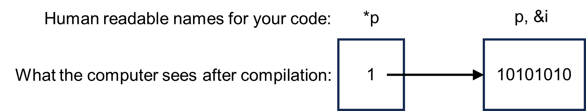

.. role:: console(code)
   :language: console

.. role:: C(code)
   :language: C

.. role:: cpp(code)
   :language: cpp

.. _pointers:

Pointers and smart pointers
===========================
Python doesn't have pointers, it works a bit differently. You thus won't meet them until towards the end of the course. For languages such as C/C++ and Rust, pointers are an important part of how the languages can be used to write high performance code. You thus need to have some awareness of what they are, to enable you to do deeper and further in future work, even if we don't make a lot of use of them in this course. 

What is a pointer
-----------------
Understanding pointers relies on you having some understanding of how the memory inside a computer is used. That is, the concept of data being stored at an *address*. This idea of having an address, separate from whatever is kept at the address, makes the concept of pointers much easier to follow.

Like with many storage systems, we don't just put data into the computer memory anywhere. It's organized for use to make things easy and efficient to find and to modify. This organization (to a first approximation) is done by the computer and/or operating system for us, largely behind the scenes so we don't have to remember lots of addresses ourselves. Nevertheless, both the address of a memory location, and the contents of that location, are available to our programs. 

The table below shows an example of 8 bit (1 byte) words being stored at a particular address, here with the addresses starting at 0. (Note that if a data item requires more than one byte, the overall address is said to be the address of the first byte used.)

.. list-table::
   :widths: 25 25
   :header-rows: 1

   * - Address
     - Contents (in binary)
   * - :console:`0`
     - :console:`01010101`
   * - :console:`1`
     - :console:`10101010`
   * - :console:`2`
     - :console:`11111111`
   * - :console:`3`
     - :console:`00000000`
   * - :console:`...`
     - :console:`...`
   * - :console:`n-1`
     - :console:`01010111`

Normally, with our programs we don't need to know the address that our data is stored at. Just giving the name of the variable is enough, and the computer will work out the address for us. We never see the internals of which memory location is used. This makes our code easier to write as we don't need to know about where the computer is storing the data. It can pick whatever is optimal, and we can use a nice human readable name in our code. 

Sometimes we do want to know the address of the data. This allows us to manipulate the data at that address, and gives us very precise control over the memory that used by the program. You'll also see in your digital electronics course that input/output ports on a microprocessor are *memory mapped*. The input (say) is given an address in memory and we can read from the input by reading from the address of the given memory location. 

However, we don't necessarily want to know the numeric address (:console:`0` to :console:`n-1` in the table above), as this is hard to remember, and will likely be different for different computers depending on what else is in the memory when the program is run. 

To overcome this, addresses can be stored in a pointer variable. These pointers let us give a human readable name to an address, to make our code easier to read. It's important to remember that they are an address, a pointer to where the actual data is stored, rather than the data itself. A graphical representation of this is below.

How to work with raw pointers
-----------------------------
The general syntax for working with pointers is to use :C:`*` to represent the contents that are being pointed to, and :C:`&` to represent the address. That is, we can write

.. code-block:: C
	
   int i;
   int *p;
   p = &i;

and :C:`p` will now *point* to :C:`i`. The two lines of code below

.. code-block:: C

   i = 7;
   *p = 7;

will have exactly the same functionally, because :C:`i` and :C:`*p` are both accessing the same location in the computer memory.

As :C:`p`, or :C:`&i` in the above are storing addresses, we can perform *pointer arithmetic* to change which memory location we're looking at. For example

.. code-block:: C

   *(p+1)

is accessing the memory location, one address up from :C:`p`. This is very useful when accessing elements in an array. 

In C you can use :C:`free()` to release the pointer once you've finished with it. Other languages have similar, but differently named, commands.

.. _smart_pointers:

Smart pointers
--------------
Pointers are extremely important and very useful when writing low level code. As, essentially, everything on a computer is given an address in memory, pointers let you use this address in order to enable lots of advanced functionality (which we won't go into much detail on here).

However, pointers are also a common source of programming errors. You need to think about the *lifetime* of a variable or piece of memory. You can have a *dangling pointer* if you're pointing to a memory location that is no longer being used, and no longer contains valid data. You can have a *null pointer deference* if you try to use a pointer which doesn't point to a valid memory location. You can have a *buffer overflow* if you try and access say :C:`*(p+2)` but this is actually a different variable to :C:`*p` because you've mis-counted how big the item is in memory and have accidentally gone on to the next item. You can also have *memory leaks*, as in the example below. All can be avoided, but it's up to you to add suitable checks to your code for these and other pointer errors. 

To help overcome this, many languages including Rust and C++ have *smart pointers*. Ideally you would probably only work with raw pointers today when writing C code as it doesn't support smart pointers. (You can use raw pointers in C++, Rust, and similar, it's just that they also include better tools to help you write error free code.) Indeed, one of the key features of Rust and modern C++ are tools to help you think about the *lifetime* of a piece of memory to help make sure you use it correctly. 

A smart pointer is simply a wrapper around a raw pointer. This wrapper includes additional functions that help make sure the pointer is always used correctly. 

Here we'll use a C++ example to demonstrate this. You could make a raw pointer, to point to an integer as 

.. code-block:: cpp

   void my_func()
   {
   // Using a raw pointer -- not recommended
   int* ptr = new int(77);

   // Code functionality goes here

   // Delete the pointer to free up memory when finished with it
   delete ptr;   
   }

Here it's up to you the programmer to remember to delete :cpp:`ptr` once you no longer need it. Otherwise you have a *memory leak*. That is, you risk your program using more and more memory over time (until it eventually crashes) as you're claiming memory each time the function is called, but not releasing it once you've finished using it. It can be hard to spot memory leaks. For example, say the code was now

.. code-block:: cpp

   void my_func()
   {
   // Using a raw pointer -- not recommended
   int* ptr = new int(77);
   int x = 15;

   // Code functionality goes here
   // ...

   // Then have a check
   if (x == 0)
   {
       return;
   } 

   // Delete the pointer to free up memory when finished with it
   delete ptr;   
   }

The :cpp:`return` command in the if statement causes the function to stop, in this case if :cpp:`x` is 0. However, this will mean the :cpp:`delete ptr` line never runs! You remembered to delete the pointer at the end of the function, but not for evert possible case in the code and so there's still a potential memory leak present. 

Smart pointers will automatically check and delete the pointer for you when its no longer needed (it goes *out of scope*). In C++ there are several ways of making a smart pointer, with different properties. :cpp:`std::unique_ptr` is for when you only have one pointer to a piece of memory. The above example could be written as 

.. code-block:: cpp

   void my_func()
   {
   std::unique_ptr<int> prt(new int(77));
   int x = 15;

   // Code functionality goes here
   // ...

   // Then have a check
   if (x == 0)
   {
       return;
   }
   }

You, the programmer, don't have to remember to do all of the pointer management by hand. The code above won't have a memory leak, as the smart pointer will automatically delete the pointer for you. 

The general rule of thumb would be to always use a smart pointer if you can, rather than a raw pointer. They just help you avoid common pointer errors. 