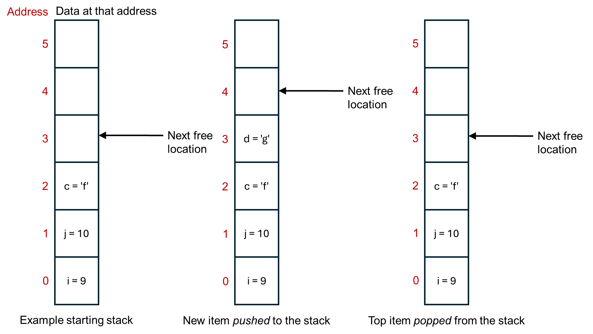

.. _stack_and_heap:

Stack and heap memory
=====================
Inside the computer, memory is divided into two parts: *stack* memory and *heap* memory. These are *software level* concepts, it's how the computer chooses to organise it's memory, rather than reflecting how the memory is physically present. These two different types of memory work, and are optimized, in different ways. For lower level programming, such as in C, C++, and Rust, making suitable use of the stack vs. the heap is an important part of programming. 

Stack memory
------------
When a program starts, typically it is allocated some memory on the stack. Usually a few Megabytes. This is enough for getting most programs started, and may be enough for some small programs in their entirity. It's not enough for putting everything on though, particularly if you're working with large datasets. It's not intended to be enough - it should get to started and then after that you the programmer need to think about the memory management. 

Memory in the stack is *contiguous*. That means that all of the memory locations are next to each other, in a stack. It in fact operates as first in, first out buffer. This is illustrated below.

.. admonition:: Aside

   Opposite to how the figure above is drawn, the stack usually starts at the top and grows *downwards* in terms of memory addresses. That way, the last address is always 0, no matter how big the overall stack is.

Stack memory is only visible to your program, the current thread that's running. 

Each time a new variable (or similar) is made, it's put on the top of the stack. The computer thus doesn't have to search for a suitable memory location, it just puts the next item on top of the big pile of items that it already has. Variables on the stack are automatically deleted when they go out of scope, say when a function exits.

You can also manually add or remove things to the stack yourself. *Pop* means to remove whatever is at the top of the stack. *Push* is to add an item to the top of stack. Each programming language will have its own commands for doing these. 

Due to these properties, the stack memory is very quick. You, and the computer, don't need to think about where to put things in the memory. It just goes in the next available slot.

It comes at the cost of being small in size. (The operating system can't guarantee to give every program Gigabytes of memory on the stack, you'd quickly run out of memory when running more than one program at the same time.) You can get *stack overflow* errors when the stack runs out of space. You also really need data that is of a fixed size. If the data might change size while the program is running, its hard to move the stack point on my the correct amount to point to the next free memory location. 

Heap memory
-----------
In contrast, the heap is a larger memory area that your program can request to use space on, as much as it needs. (The operating system might say no if it's doesn't have space, and so programs should check that any request for heap memory was successful, before they try to use it.)

Heap memory is also available to other threads on the computer, and so important to use when writing multi-threaded programs. 

As soon as you move beyond small simple programs in languages such as C, C++, and Rust, you probably want to be working with heap memory. Each language has its own commands for requesting and interacting with heap memory, generally via pointers or smart pointers. Will see how to do this in the labs.  

The disadvantage of heap memory is that is it slow compared to stack memory. For example, there is overhead in searching for available memory space, whereas the stack just uses the next memory location along. Frequent allocation and deallocation of memory can also lead to fragmentation, where things are stored in small, non-contiguous blocks, and this decreases the performance of getting things from memory. If you want to increase the size of an object, but the next memory location up is already being used to store something else, there can be a lot of overhead in finding a new memory location that's big enough and moving everything to that location. When feasible, you probably want to avoid dynamically growing items on the heap. Instead, reserve as much memory as you need in advance, or research large-ish (whatever that means for your program size) in advance in blocks rather than doing lots of small requests.
