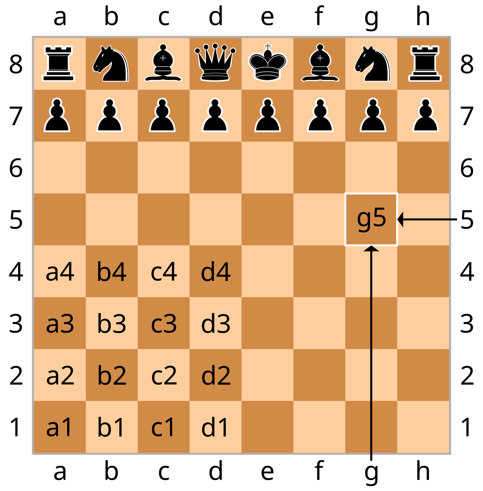

.. role:: python(code)
   :language: python

.. _variables:

Variables
=========

.. _single_variables:

Single variables
----------------
The basic unit for storing data is a *variable*. There are then lots of further variable *types* giving other ways of storing data.

Each variable has a name, and then a value stored in it. This way, in other parts of the code you can refer to the name, which will be the same whatever data is stored in the variable. 

Values are put into variables by using the equals :python:`=` operator. The variable name goes on the left, and the value to store goes on the right. For example

.. code-block:: python 

    num = 2
    pi_ish = 3.1415
    name = "alex"
    check = True
    blank = None

Storing multiple values
-----------------------
Generally variables store one thing at a time. This is fine, but we often have data which has more than one *property* which needs to be stored. For example, consider the chess board shown below. (Taken from `Wikipedia <https://en.wikipedia.org/wiki/Algebraic_notation_%28chess%29>`_, re-used under `CC BY-SA license <https://creativecommons.org/licenses/by-sa/3.0/>`_.)

Each piece has both an *x* coordinate, denoted by a letter, and a *y* coordinate, denoted by a number. It doesn't make any conceptual sense for a piece to have an *x* coordinate but not a *y* coordinate. That wouldn't correspond to any valid place for a playing piece to be. Thus, while the below would work

.. code-block:: python 

    piece1_x = "a"
    piece1_y = 3

it probably isn't the best way of doing it. It would be easy to have a single typo, say :python:`piece2_y` and you'll start getting strange behavior.

Instead there are multiple different ways in which multiple pieces of information can be grouped together under a common variable name. (Here we won't worry about the fact that in chess there are also multiple pieces which you might want to group to help you keep track of them.)

Tuples
------
A *tuple* groups data together inside round brackets :python:`()` separated by commas :python:`,`. For the example above, the position could thus be

.. code-block:: python 

    piece1_pos_t = ("a", 3)

There are now two pieces of information, a *x* coordinate and a *y* coordinate both fundamentally stored under a single name to help keep them together. 

The individual *elements* in a list can be accessed by using square brackets :python:`[]` and a number as an *address*. These addresses start at 0. So, :python:`piece1_pos_t[0]` contains :python:`"a"` and :python:`piece1_pos_t[1]` contains :python:`3`.

In this simple example there are only two pieces of information in the tuple. You can of course have much larger tuples if needed to store the different items that you're working with. 

Tuples are *immutable*. Once made the contents can't be changed. 

.. _lists:

Lists
-----
A *list* groups data together inside square brackets :python:`[]` separated by commas :python:`,`. For the example above, the position could thus be

.. code-block:: python 

    piece1_pos_l = ["a", 3]

The individual elements in a list can be accessed by using square brackets :python:`[]` and a number as an *address*. These addresses start at 0. So, :python:`piece1_pos_l[0]` contains :python:`"a"` and :python:`piece1_pos_l[1]` contains :python:`3`.

In this simple example there are only two pieces of information in the list. You can of course have much larger lists if needed to store the different items that you're working with. 

The main difference from a tuple is that lists are *mutable*. You can use

.. code-block:: python 

   piece1_pos_l[0] = "b"
   piece1_pos_l[1] = "6"

to update or change the values that are stored in the list. There are more commands, which we'll meet in the labs, for adding or removing elements from a list.

.. _dictionaries:

Dictionaries
------------
A *dictionary* groups data together inside curly brackets :python:`{}` and in addition to the raw information to be stored, each piece of information is given its own name known as a *key*. :python:`,`. You get to pick the key names. For the example above, the position could thus be

.. code-block:: python 

   piece1_pos_d = {"x": "a", "y": 3}

The individual elements in a dictionary can be accessed by using square brackets :python:`[]` and the key name. So, :python:`piece1_pos_d["x"]` contains :python:`"a"` and :python:`piece1_pos_d["y"]` contains :python:`3`.

In this simple example there are only two pieces of information in the dictionary. You can of course have much larger dictionaries if needed to store the different items that you're working with. 

Dictionaries are mutable. The main difference from tuples and lists is that you use a key, here :python:`"x"` or :python:`"y"`, as the *address* of the data, rather than a number. In various cases this might help make the code more readable. 

Multi-dimensional items
-----------------------
The above examples are all one-dimensional. For example we had :python:`piece1_pos_l[0]` and :python:`piece1_pos_l[1]`. We can have multi-dimensional items as well. For example, a 2D list might look like:

.. code-block:: python

   a = [[0, 1, 2], [3, 4, 5], [6, 7, 8]]

Here :python:`a[0][0]` contains 0. 

Alternatively, as a second example, you can store tuples in a dictionary:

.. code-block:: python

   a = {'piece1': ("a", 1), 'piece2': ("a", 2)}

By combining variable types, you can build up some quite complicated and multi-dimensional data structures. 

Which should I use
------------------
You might find that there are performance differences between the different ways of storing data, for your problem some may execute faster than others. 

More generally, you should use whichever fits the type of data/problem that you have to work with, to try and *force* the code to be correct.

For a chess piece, a tuple probably doesn't fit - a chess piece has to move and so it's position should be stored in a variable type which can be changed and updated. Both a list or a dictionary are probably fine. A dictionary might give more readable code. :python:`piece1_pos_d["x"]` is a bit more clear that it's the *x* location, compared to :python:`piece1_pos_l[0]` where you have to remember 0 represents the *x* coorinate. Remember, with a dictionary you get to pick the key names, and so you can use names that are meaningful to you. 

Other variable types
--------------------
There are many more variable types (sometimes called *collections*) beyond the three listed here. These are just the *getting started* ones. You'll likely encounter more as you get further into your Python programming, and so don't assume these are all there is. 

For electronic engineering in particular, in Python it's very common to use *numpy arrays* as a variable type. We'll see these in the labs. 