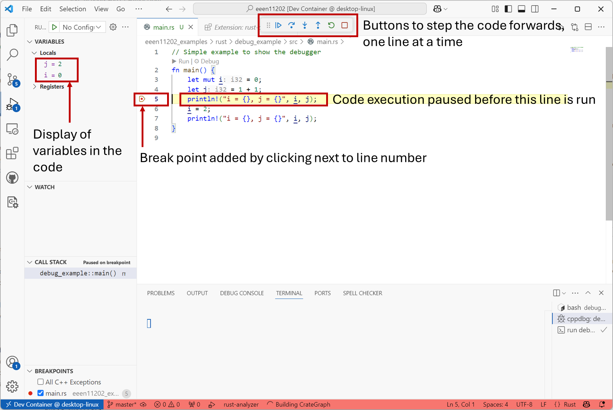

.. role:: rust(code)
   :language: rust

.. _debugger:

Debugger
========

The debugger is for analyzing your code, while it is running. It puts the code into a special state which lets you look at (say) the value of a variable. This makes the code slower to execute, as everything needs to be logged, but is very useful for examining what's going on when things aren't working as expected. Most debuggers then let you then step through the code, say line-by-line, to let you pin-point errors and, hopefully, fix them. An example in Rust is shown below.

Here, a *break point* has been added, by clicking next to the line number. When compiled and run, the program executes up to the break point, and then pauses. Debug information is then displayed and can be used to help you fix the program. For example, you can change the value of a variable by hand, and then continue the execution to see what happens. 

In the example above, the error is probably a typo. Line 4 should probably be :rust:`i+1` rather than :rust:`1+1`. Static code analysis struggles to spot this, as :rust:`1+1` is perfectly valid code, just probably not what's wanted in this case. (Also :rust:`i` is used later on in the code, so static analysis can't detect that it's not being used.)

It's worth spending some time exploring the debugger as it's an incredibly powerful tool for identifying and fixing issues with your code. For example, you can add conditional break points, which will only trigger the program to pause execution if certain conditions are met.

.. admonition:: This course

   We'll use debugging in VSCode a lot throughout the course and you'll be expected to be familiar with how to use this. 

   Note that debuggers show the limitations of VSCode as an IDE. For example, the GUI buttons in VSCode will only let you step forwards through the code, to see what happens next. Some debuggers will let you do *reverse debugging*, where you can step backwards through the code to see how it got into a particular state. In VSCode you have to run this from the command line, there's no GUI button for it. We thus won't look in to it, but do remember there are lots of tools available to help you above and beyond the ones we do cover. Don't limit your thinking or reading to only the ones considered here. 
