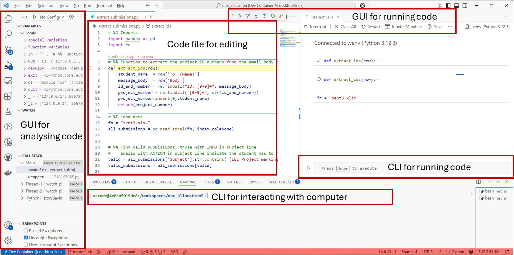

Integrated Development Environments (IDEs)
==========================================

There isn't one single tool that does everything from writing your code, compiling your code, debugging your code, applying version control, and so on. Instead we rely on lots of different tools working together. We bring these different tools together in an *Integrated Development Environment* (IDE) which gives easy access to all of the different tools in one place.

There are lots of different IDEs, with different strengths and weaknesses, and some paid for and some free. Major ones which you might hear about include:

- Visual Studio. This is only for development on Windows.
- Xcode. This is only for development on macOS.
- Eclipse. This is a cross-platform IDE.

We're going to use the `VSCode <https://code.visualstudio.com/>`_ IDE. (Don't confuse VSCode with Visual Studio. Both are made by Microsoft, and both are installed on the University computers, but they are different programs.) 

In general VSCode is a bare bones IDE (it's more an advanced text editor) but it is a good starting point. The other IDEs listed above are much more fully featured with many capabilities, but that makes them a bit overkill for starting out where we won't be using many of these capabilities. 

You'll learn how to use VSCode in detail in the labs, but the screenshot below shows an example how it brings together multiple different tools in a GUI to let you easily access them.

Note that there's a terminal built in to this GUI. You don't have to start a separate one. That is, when you start VSCode it will automatically give you a command line for entering commands into.

Remember that the VSCode environment is very configurable, and exactly what is displayed will vary depending on which *Extensions* you have installed, and which programming language you're using. Don't worry if yours looks different or doesn't have some of the options shown above.

.. admonition:: This course

   We're going to use VSCode. We'll expect you to know how to use this, including in the exam. You're welcome to use a different IDE if you would like, but it will limit the extent to which we'll be able to help - we don't know every detail about every IDE that's out-there, and haven't tested the course notes against them. 
